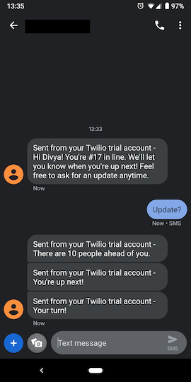

# Product Description

Tired of waiting in line, being bored and wasting your time? Get your number in line and leave to grab coffee or anything else you'd rather do. upNext will text you when you're up next in line!



## Steps to Send (Outbound) MMS

#1

```bash
npm install twilio
```

#2 Write the `send-sms.js` file

#3

- Write the `twilio.env` file
- Include `.env` in `.gitignore`

```bash
source ./twilio.env
```

#4

```bash
node send-mms.js
```

returns sends an MMS `to` the number provided

## STEPS to Receive (Inbound) SMS

#1

```bash
npm init -y
npm install express ngrok
```

#2 Write the express app in `server.js`, then

```bash
node server.js
```

returns the ngrok public URL

#3 In your Twilio account, go to Manage Numbers > Active Numbers > Messaging > A Message Comes In:

- select Webhook from the dropdown
- copy-paste the ngrok public URL in the input box
- Save

#4 Respond to the SMS from the Twilio number

- this sends a request to the ngrok public URL
- you may go to [http://localhost:4040](http://localhost:4040) in the browser to inspect the request and response and to debug
